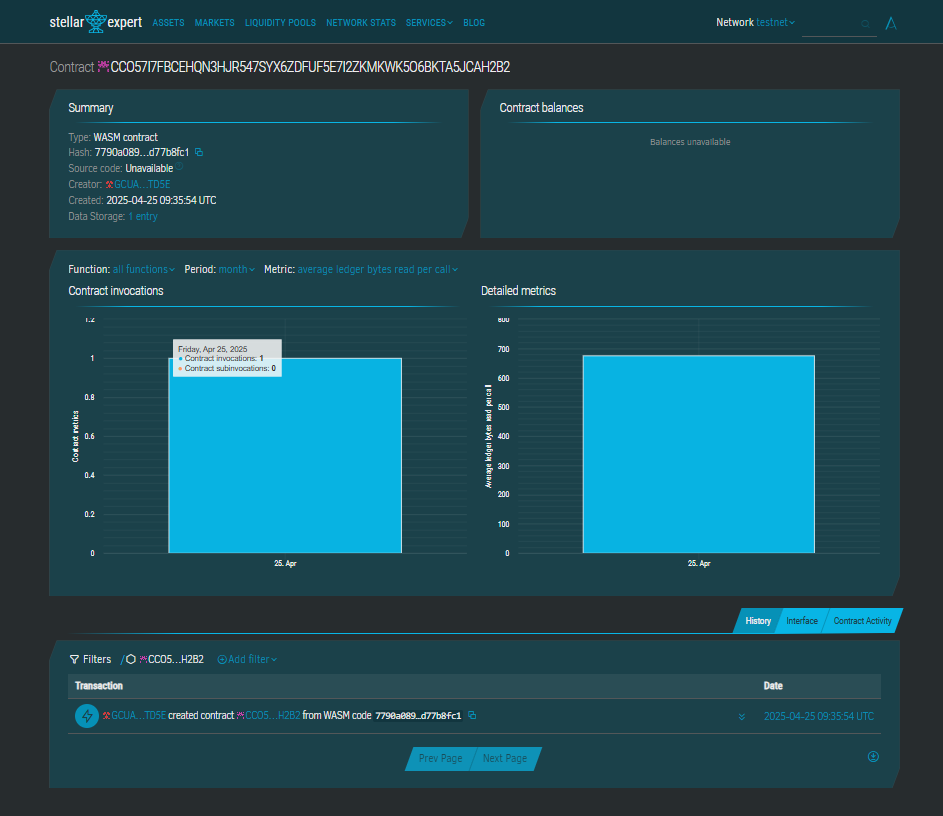

# Mobile Apps

## Project Description
This smart contract enables basic operations for registering, installing, and viewing mobile applications on a decentralized platform. Designed using Soroban SDK, the contract simulates a mobile app store where users can list and manage their applications on-chain.

## Project Vision
To create a decentralized mobile app registry where developers can publish apps and users can interact with them transparently. This is an early step toward a dApp marketplace built on blockchain technology.

## Key Features
- 📱 **App Registration:** Developers can register their apps with a name and description.
- ✅ **App Installation Tracking:** Track whether an app is installed or not.
- 🔍 **App Retrieval:** Users can view app details using a unique ID.
- 🔢 **App Count:** Retrieve total number of registered apps.

## Future Scope
- ✨ User-specific installation tracking
- 🗃️ Categories and tags for apps
- ⭐ App rating and review system
- 🔐 Access control for app management
- 📦 In-app purchase simulation

## Contract Details
CCO57I7FBCEHQN3HJR547SYX6ZDFUF5E7I2ZKMKWK5O6BKTA5JCAH2B2

